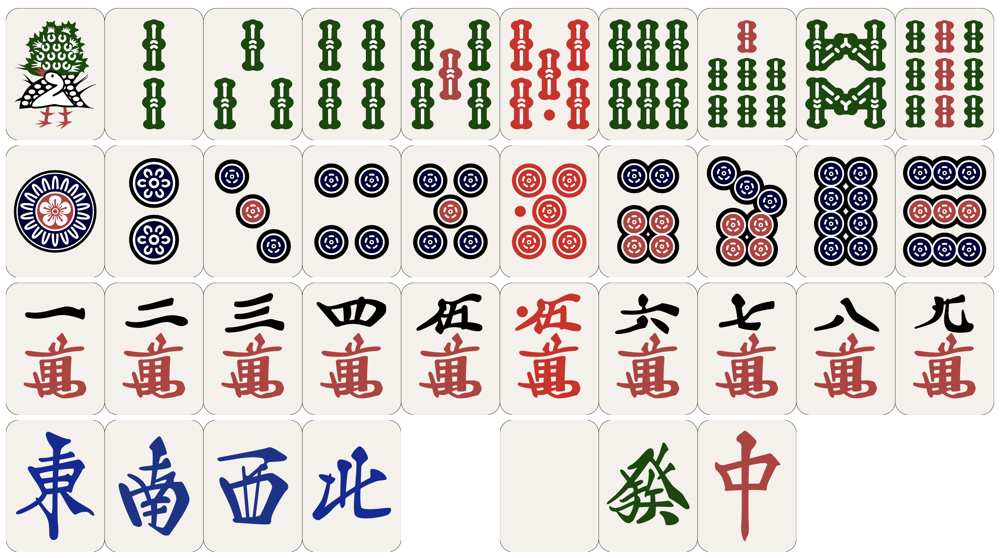
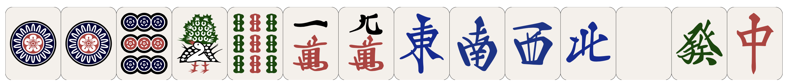

# mahjong-tex
A LaTeX 3 package for typesetting mahjong hands using MPSZ algebraic notation.
This package provides an interface for LaTeX 2e, so you can use it without any experience in LaTeX 3.



This package focuses on Riichi (a.k.a. Japanese) Mahjong but can be used to typeset any style.
However, flower tiles are currently missing.

## Usage
```
\usepackage{mahjong}
\mahjong{<tiles>}
```
Insert mahjong tiles as specified by `<tiles>`. For instance,
```
\mahjong{119p 19s 19m 1234567z}
```
produces an image of the "Thirteen Orphans" hand with a pair of 1 dots.



Additional supported features are:

* Red fives
* Concealed tiles
* Spaces
* Blank tiles
* Rotated tiles (90° counter-clockwise)
* Stacked, rotated tiles

```
\mahjong{X44Xp-123's-50"5m-33?z}
```


The size of the typeset hand can be changed.
Either locally as an optional argument to `\mahjong` or as a package option.

## Prerequisites
You need a sufficiently recent version of LaTeX which ships with the L3 programming layer.
This applies to all version released after October 2019.

mahjong depends on stackengine, which is included in all major TeX distributions.

## Building
A simple invocation of make is enough to produce a zip file in `out/` which can be submitted to CTAN.
```
make
```

## Installation
Run
```
make install
```

to install the package to your local texmf directory.
It should be available for use in your documents.

Run
```
texdoc mahjong
```
to get an introduction to the package, including the extended flavor of MPSZ notation this package uses.

## Attribution
The mahjong tiles used in this package were created by [@FluffyStuff](https://github.com/FluffyStuff).
The original repository is [FluffyStuff/riichi-mahjong-tiles](https://github.com/FluffyStuff/riichi-mahjong-tiles), used under CC-BY.